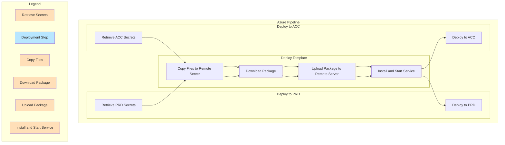

## Azure Pipeline Documentation

### Description
The `azure-pipelines.yaml` file is a YAML-based definition file for an Azure Pipeline. It defines two jobs: `DeployToAcc` and `DeployToPrd`. Each job is responsible for deploying an application to a specific environment using the defined parameters and variables.

The `deploy-template.yaml` file is a template pipeline that is used by both jobs. It contains a set of steps to perform the deployment process, including copying files to a remote server, downloading a package, uploading the package to the remote server, and installing and starting a service.

### Input Parameters
1. `acc_env`: Represents the configuration for the ACC (Acceptance) environment. It is an object type parameter with the following properties:
   - `name`: Name of the ACC environment (e.g., "acc").
   - `host`: Host address of the ACC environment.
   - `username`: Username for authentication in the ACC environment.
   - `package_version`: Version of the package to be deployed.
   - `vaultName`: Name of the Azure Key Vault associated with the ACC environment.
   - `subscription`: Subscription ID for the ACC environment.

2. `prd_env`: Represents the configuration for the PRD (Production) environment. It has the same structure as `acc_env` but contains the configuration specific to the PRD environment.

### Defined Variables
1. `agent_pool_name`: Represents the name of the Azure Agent Pool with Windows type. Example value: "CUSTOM_WINDOWS".

2. `package_name`: Represents the name of the package to be pulled and deployed. Example value: "MyApplication".

3. `package_feed`: Represents the name of the Universal Package Feed. Example value: "UniversalPackageFeed".

4. `service_dir`: Represents the directory path of the service in the remote server. Example value: "O:\AppService\".

### How to Use
To use this Azure Pipeline, follow these steps:

1. Define the required input parameters for the ACC and PRD environments. Specify the appropriate values for each parameter.

2. Modify the defined variables (`agent_pool_name`, `package_name`, `package_feed`, and `service_dir`) if necessary, depending on your specific environment and package details.

3. Ensure that the necessary secrets are stored in the Azure Key Vault associated with each environment.

4. Set up the appropriate triggers for the pipeline. In the given definition, it is triggered only for the "master" branch. Adjust the trigger configuration based on your requirements.

5. Save the `azure-pipelines.yaml` and `deploy-template.yaml` files in your Azure DevOps repository or any Git repository accessible by your Azure Pipeline.

6. Create a new pipeline in Azure DevOps or open an existing pipeline definition.

7. Copy the contents of `azure-pipelines.yaml` and replace the existing pipeline definition with it.

8. Save the pipeline definition.

9. Run the pipeline, and it will deploy the application to both the ACC and PRD environments sequentially.

### Example Use
Suppose you have an application named "MyApplication" that needs to be deployed to both the ACC and PRD environments using Azure Pipelines. The following is an example of how you can configure the pipeline:

#### Input Parameters
- ACC Environment:
  - `name`: acc
  - `host`: acc.example.com
  - `username`: acc_user
  - `package_version`: 1.0.0
  - `vaultName`: acc-vault
  - `subscription`: acc-subscription-id

- PRD Environment:
  - `name`: prd
  - `host`: prd.example.com
  - `username`: prd_user
  - `package_version`: 1.2.

0
  - `vaultName`: prd-vault
  - `subscription`: prd-subscription-id

#### Defined Variables
- `agent_pool_name`: CUSTOM_WINDOWS
- `package_name`: MyApplication
- `package_feed`: UniversalPackageFeed
- `service_dir`: "O:\AppService\"

#### Example Use
1. Trigger the pipeline based on the configured branch trigger, e.g., when changes are pushed to the "master" branch.

2. The pipeline will first deploy the application to the ACC environment:
   - Retrieve secrets from the ACC Key Vault.
   - Use the `deploy-template.yaml` template with the provided parameters, including the ACC environment configuration and variables.
   - Perform the necessary steps defined in the template, such as copying files to the ACC server, downloading the package, and installing the service.

3. Once the deployment to the ACC environment is complete, the pipeline will deploy the application to the PRD environment:
   - Retrieve secrets from the PRD Key Vault.
   - Use the `deploy-template.yaml` template with the provided parameters, including the PRD environment configuration and variables.
   - Perform the necessary steps defined in the template, similar to the ACC deployment.

4. The pipeline run will complete, and the application will be deployed to both the ACC and PRD environments, following the defined steps and configurations.

Note: Make sure to replace the placeholder values ("<ACC_HOST>", "<ACC_USERNAME>", "<ACC_VAULT_NAME>", "<ACC_SUBSCRIPTION_ID>", "<PRD_HOST>", "<PRD_USERNAME>", "<PRD_VAULT_NAME>", "<PRD_SUBSCRIPTION_ID>") in the parameter default values with the actual values specific to your environments.

## Workflow graph

